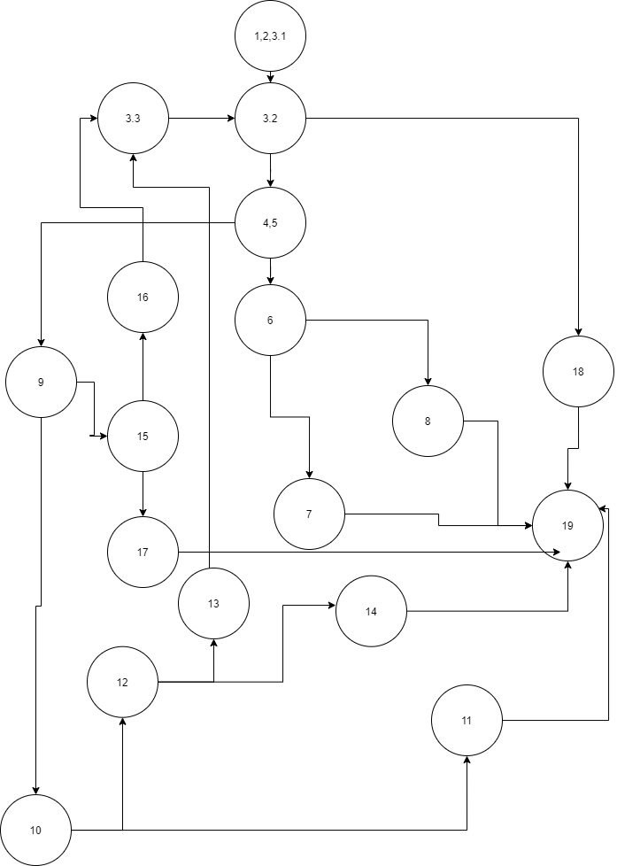

# Втора лабораториска вежба по Софтверско инженерство

## Марко Николовски, 155040

###  Control Flow Graph

### Цикломатска комплексност

Цикломатската комплексност на овој код е 8, истата ја добив преку формулата P+1, каде што P е бројот на предикатни јазли. Во случајoв P=7, па цикломатската комплексност изнесува 8.

